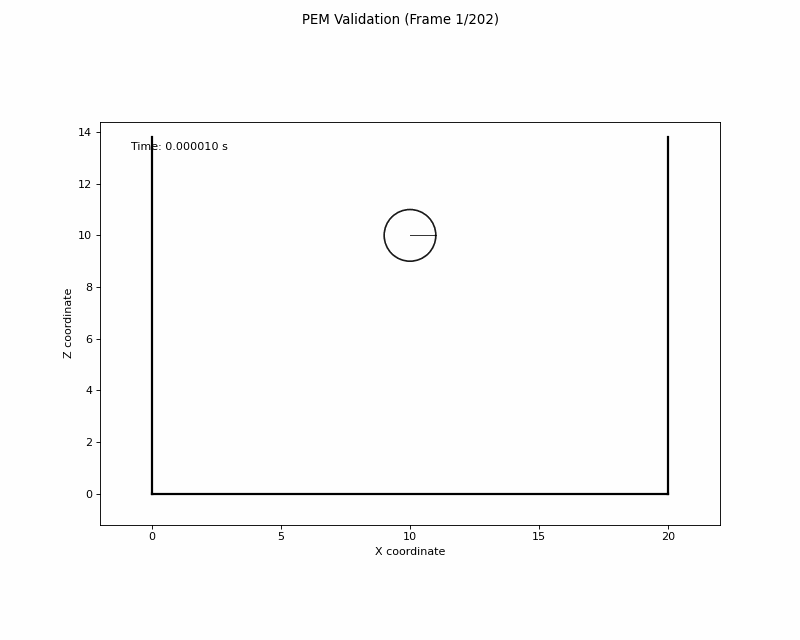

# PEM - 2次元粒子要素法シミュレーター

2次元粒子要素法（Particle Element Method）による離散要素法シミュレーションプログラムです。粒子間の接触・衝突現象をHertz接触理論に基づいて数値計算します。



## 🔬 主な機能

- **2次元粒子シミュレーション**: 最大1000個の粒子による動的解析
- **Hertz接触理論**: 理論的に確立された接触力モデル
- **検証モード**: 2粒子の一次元衝突による理論値検証
- **セル格子システム**: 効率的な近傍探索アルゴリズム
- **エネルギー保存チェック**: 数値計算の精度検証機能

## ディレクトリ構造

```
PEM/
├── src/
│   └── pem_simulator.f90    # メインプログラム（Fortran90）
│   └── animate_pem.py       # 可視化用プログラム (Python)
├── data/                    # シミュレーション結果出力
├── reference/               # 参考資料・理論値
├── pem_animation.gif        # シミュレーション結果のアニメーション
└── README.md               # このファイル
```

## 🚀 使用方法

### コンパイル
```bash
# ディレクトリの移動
cd PEM/src

# Fortranコンパイラを使用
ifort pem_simulator.f90 -o pem_simulator

# または最適化オプション付き
ifort -O3  pem_simulator.f90 -o pem_simulator 
```

### 実行
```bash
# シミュレーション実行
./pem_simulator

# animate_pem.pyを用いてアニメーション化
python3 animate_pem.py
```

## ⚙️ シミュレーションパラメータ

### 主要定数
- **最大粒子数**: 1000個
- **最大接触点数**: 13点
- **セル数**: 20000
- **時間刻み**: 5.0×10⁻⁷ 秒

### 検証モード設定
- **粒子数**: 2個
- **粒子半径**: 5.0×10⁻³ m
- **初期速度**: 20 m/s
- **密度**: 1.0 kg/m³
- **摩擦係数**: 0（完全弾性衝突）

## 🧮 理論的背景

### 接触力計算
本シミュレーターは以下の理論に基づいています：

#### Hertz接触理論
- **法線方向剛性**: K_n = (4/3) × E_eff × √(R_eff)
- **接線方向剛性**: K_s = K_n × (2-ν)/(2-2ν)

#### 粘性減衰
- **減衰係数**: η = -2 × ln(ε) × √(m_eff × K / (ln²(ε) + π²))
- **反発係数**: ε（材料特性）

### 数値積分
- **時間積分**: Velocity-Verlet法
- **位置更新**: r(t+Δt) = r(t) + v(t)Δt + (1/2)a(t)Δt²
- **速度更新**: v(t+Δt) = v(t) + (1/2)[a(t) + a(t+Δt)]Δt

## 📊 出力ファイル

シミュレーション結果は `data/` フォルダに以下の形式で出力されます：

- **粒子位置**: 各時刻での粒子座標
- **速度データ**: 粒子の速度ベクトル
- **接触力**: 粒子間および壁との接触力
- **エネルギー**: 運動エネルギー・ポテンシャルエネルギー

## 🔍 検証機能

### 一次元弾性衝突検証
2個の粒子による完全弾性衝突をシミュレーションし、以下を検証：

1. **運動量保存**: 衝突前後の運動量比較
2. **エネルギー保存**: 運動エネルギーの保存確認
3. **理論値との比較**: 衝突前後の粒子速度について、解析解との誤差評価

## 🛠️ プログラム構造

### 主要モジュール
- `simulation_constants_mod`: 定数定義
- `simulation_parameters_mod`: 物理パラメータ
- `particle_data_mod`: 粒子データ管理
- `cell_system_mod`: セル格子システム

### 主要サブルーチン
- `fposit_sub`: 粒子配置設定
- `inmat_sub`: 材料物性初期化
- `wcont_sub`: 壁接触力計算
- `pcont_sub`: 粒子間接触力計算
- `nposit_sub`: 位置・速度更新
- `actf_sub`: 接触力計算

## 📋 計算環境

京大のスパコン Camphor を使用。


## 🔧 カスタマイズ

### パラメータ変更
`src/pem_simulator.f90` の以下の部分を編集：

```fortran
! 粒子数変更
integer, parameter :: max_particles = 1000

! 時間刻み変更
real(8), parameter :: dt = 5.0d-7

! 材料物性変更
real(8), parameter :: young_modulus = 2.0d11
real(8), parameter :: poisson_ratio = 0.3d0

! 検証モードの切り替え
logical :: validation_mode = .false. ! 検証モードオフ

```

## 📚 参考文献

1. Hertz接触理論: "Über die Berührung fester elastischer Körper" (1881)
2. 離散要素法: Cundall & Strack (1979)
3. 粒子法シミュレーション: 越塚誠一著

## 📞 サポート・連絡先

質問やバグ報告は [GitHub Issues](https://github.com/244x050xShotaTakahashi/PEM/issues) までお願いします。

---

**開発者**: 244x050xShotaTakahashi  
**更新日**: 2025年7月3日  
**バージョン**: 1.0.0